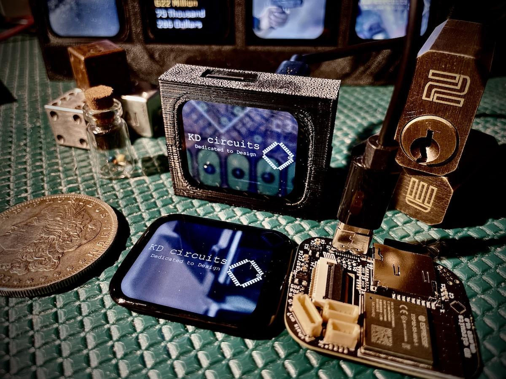

vPlayer - Ultimate IoT Display
===================================

**Compact touchscreen ESP32-S3 device with WiFi, Bluetooth, SD card, USB-C, and expansion for video, IoT, and endless creative projects.**

.. warning::

   These docs are still a work in progress. Some sections may be incomplete or subject to change. Updates will be coming daily!!

The vPlayer is the ultimate 1.69" Touch Screen (smart watch sized) ESP32-S3 based video player, IoT device, monitor, live camera feed display, GUI interface controller, or whatever you can dream up that would look cool on your desk! Here are a few examples I have already coded up:

:ref:`Continuous video player <video_player_project>` take any video files you can think of and it will just play those endlessly from an SD card! This is my go-to for gifts. I have one that is just simple decoration that plays Christmas movie clips... about 100 of them! Also, I have one that plays retro video game play throughs - that's my favorite! Oh! and for business gifts, I animate their logo or marketing material from their site that plays continuously. NOTE! I have created my own software to convert .mp4 files to mjpeg at the exact resolution and frame rate. See the docs for more info.

**Weather Display** This is pretty much the "Hello World" of IoT displays, but it really is useful to have on the night stand so first thing I see when I get ready for the day is what the hi/lo is for the day and if it's going to rain... perfect thing for figuring out what to wear! And in my code I also show the forecast for the next day as well, so you know also before bed what it's lookin like.

**Live Traffic Camera Display - or really any webcam** This one really cool if you can find traffic cameras along your commute. You can basically check road conditions/weather/traffic/etc... at a glance. And it's so simple to setup, just pop your WiFI credentials and a list of all the traffic cam URLS in a text file - pop that in the SD card and you're good to go. I also found cameras overlooking Lake Erie (close to me) so can check boating conditions as well. Lots of possibilities with this one... can you imagine creating a grid of vPlayer boards all with this code loaded up?

**Internet Data - API's** You could go crazy with this one. Any API out there (places for you to get data) you can display on this. Pull down NASA images, Google Earth images, Quote/Joke/Trivia of the Day, or my favorite, the :ref:`National Debt <nationalDebtTracker>` in USD! Yea and even cooler is that it pulls down the previous day as well and increments or (hopefully - decrements) to the current day's value. Again, anything you can think of... maybe the Cat API would be fun? Random images of Cats?

**Computer Control/Monitor** You know we've got a USB-C connection on this board? Can receive or send anything you want - so one example I have is an app on the computer that sends CPU stats like Memory/Load/Internet Up/Down. But also, could also send data from the vPlayer as well? Like some kind of interface with buttons to control whatever you can think of. Can even act as an HID device - so mouse/keyboard/joystick.

**Local ESP32-CAM monitor** Yep, we can also receive live feeds from the ESP32 Camera. I've one of these setup just to monitor the garage, so at a glance from inside you can see if the garage was left open. Might be nice also to set this up on the front porch, or maybe even make the camera solar powered so it can be a live wildlife camera!

.. raw:: html

   <iframe width="696" height="522"
           src="https://www.youtube.com/embed/3d0yMi3bVgc" 
           title="YouTube video player" 
           frameborder="0" 
           allow="accelerometer; autoplay; clipboard-write; encrypted-media; gyroscope; picture-in-picture" 
           allowfullscreen></iframe>

Technical Highlights
---------------------

- **Processor**: ESP32-S3 Dual-Core 240MHz, 32-bit with 4MB Flash and 2MB PSRAM.
- **Storage**: Micro SD slot (card included), connected via MMC 4-bit interface.
- **Connectivity**:
  - USB-C for power and data transfer.
  - WiFi and Bluetooth for wireless connectivity.
- **Display**: 1.69" touchscreen (240x280) with P169H002-CTP, ST7789V2 driver, and CST816 touch controller. Includes backlight control.
- **Expansion Options**:
  - JST SH/SR 1mm connectors for UART, I2C, I2S (audio), SPI, and more.
  - Spare IO pads for custom development projects.
- **Open Source Support**: Comes with free examples and continued updates for open-source software.

Order Your vPlayer Today!
--------------------------

https://www.tindie.com/products/kdcircuits/vplayer-ultimate-iot-display/

Start creating your own high-tech projects now!

.. raw:: html

   

.. toctree::
   :maxdepth: 1
   
   hardware
   videoPlayer
   videoPlayer_Folder
   webcamViewer
   espProgrammer

