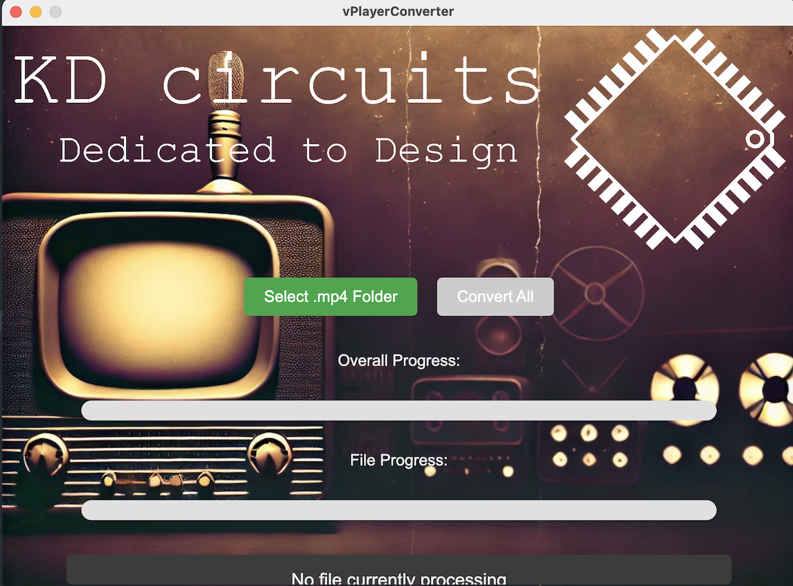

.. _video_player_project:

Video Player Project
===================================

.. image:: images/videoPlayer.jpg

This is the code that the board ships with!  

But how to load your own files? 

They need to be a specific format ".mjpeg" - I use ffmpeg for this. Here is the full command:

.. code-block:: bash

    ffmpeg -i "inputPath" -vf "fps=18,scale=-1:240:flags=lanczos,crop=280:240:(iw-280)/2:0,transpose=1" -q:v 4 -vcodec mjpeg -f segment -segment_time 1800 -reset_timestamps 1 "outputPattern"

But the good news is that I created a simple app for Windows/Mac to do this automatically. Just place all of your **.mp4** files in a folder, run the app and it will take care of the rest. Copy those .mjpeg files to your SD card.

You can download the video converter tool for Windows/Mac from the following link:

`Download the Converter <https://drive.google.com/drive/folders/1YtBq8pfR8KcjOuG6_Y1BZHH5BGuvwLpg?usp=sharing>`_

Source Code
TBD