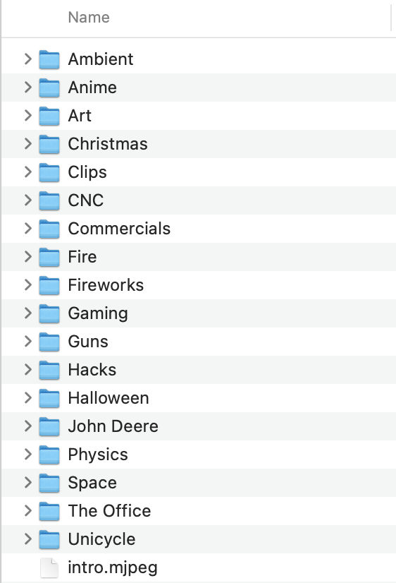

.. _video_player_with_folders_project:

Video Player with Folders Project
=================================

My Favorite Video Player Code Features
--------------------------------------

- **Auto-Play Splash Screen**  
  On boot, the player automatically loops a video—ideal for a splash screen or instructional clip.

- **Folder Previews**  
  When you tap the screen, you’ll see a snapshot of each folder’s videos. Swipe left/right or use the arrow buttons to browse.

- **Playback Modes**  
  Choose to play the videos in each folder sequentially or in shuffle mode.

- **Easy Exit**  
  To exit during video playback, just touch and hold.

- **Fast-Forward & Skip**  
  Swipe to fast-forward within a video, or tap to jump ahead.

Just organize your SD card like this:

And here is the code and bin file in the releases:

`GitHub <https://github.com/krdarrah/vPlayer_VideoPlayer_Folders>`_
